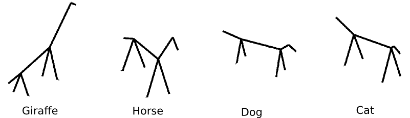

```{r init,echo=FALSE,message=FALSE}
library(imager)
library(dplyr)
```

# Generating Random Stimuli

Three reasons why people use random stimuli in psychophysics:
1. Make an easy task difficult (external noise)
2. Randomly perturb a system to study its behaviour (classification images)
3. Need stimuli with controlled statistics (many examples)

I haven't got much to say about (1), so will only talk about (2) and (3)

# Part I: Random Perturbations

I'll start with a neat study by Kontsevich & Tyler (2004)

# What makes Mona Lisa smile? 

</img>

# What they did

* Sometimes the noise causes the observer to see a smile, sometimes it's a frown 
* Idea: if there is some systematic difference between "happy" noise and "sad" noise, then the average of all "happy" noise fields should be different from the average of all "sad" ones

# Results

</img>

# Results

</img>

# Noise = Random exploration of stimulus space

```{r echo=FALSE,fig.width=8,fig.height=8}
mona <- ((load.image("figures/MonaLisa.png")-127)/255) %>% imresize(.5)
mx <- c(.6,.4)
plot.mona <- function()
    {
        plot(c(0,1),c(0,1),xlab="Pix. 1",ylab="Pix. 2",type="n")
        points(mx[1],mx[2],pch=19,cex=1)
        mona %>% as.raster %>% rasterImage(.62,.25,.72,.4)
    }
plot.mona()
```

# Noise = Random exploration of stimulus space

```{r echo=FALSE,fig.width=8,fig.height=8}
plot.mona()
(imnoise(width(mona),height(mona),1,3)*.2 + mona ) %>% as.raster %>% rasterImage(.52,.65,.62,.80)
dx <- c(-.1,+.2)
m2 <- (mx+dx)
points(m2[1],m2[2],pch=19,cex=1)
arrows(mx[1],mx[2],m2[1],m2[2],len=.12)
text(mx[1]+.25*dx[1],mx[2]+.45*dx[2],"Noise vector",srt=-60)
```

# Noise = Random exploration of stimulus space

```{r echo=FALSE,fig.width=8,fig.height=8}
plot.mona()
(imnoise(width(mona),height(mona),1,3)*.2 + mona ) %>% as.raster %>% rasterImage(.42,.15,.52,.3)
dx <- c(-.2,-.1)
m2 <- (mx+dx)
points(m2[1],m2[2],pch=19,cex=1)
arrows(mx[1],mx[2],m2[1],m2[2],len=.12)
text(mx[1]+.25*dx[1],.05+mx[2]+.45*dx[2],"Noise vector",srt=25,adj=.6)
```

# Perturbations may tell you how decisions are made

```{r echo=FALSE,fig.width=8,fig.height=8}
plot(c(0,1),c(0,1),xlab="Pix. 1",ylab="Pix. 2",type="n")
xv <- seq(-.1,1.1,l=100)
polygon(c(xv,1.1,-.1),c(1-sin(1.4*xv),-.1,-.1),col=rgb(0,0,.5,.2))
text(.6,.7,"Smiling")
text(.2,.3,"Not smiling")
points(mx[1],mx[2],pch=19,cex=1)
mona %>% as.raster %>% rasterImage(.62,.25,.72,.4)
```

# White noise perturbations 

White (Gaussian) pixel noise corresponds to sampling each pixel independently from the same Gaussian distribution.

```{r echo=FALSE,fig.width=8,fig.height=8}
plot(c(0,1),c(0,1),xlab="Pix. 1",ylab="Pix. 2",type="n")
xv <- seq(-.1,1.1,l=100)
polygon(c(xv,1.1,-.1),c(1-sin(1.4*xv),-.1,-.1),col=rgb(0,0,.5,.2))
text(.6,.7,"Smiling")
text(.2,.3,"Not smiling")
U <- cbind(rnorm(100,m=mx[1],sd=.1),rnorm(100,m=mx[2],sd=.1))
points(U,col=rgb(.2,0,0,.3))
points(mx[1],mx[2],pch=19,cex=1)
mona %>% as.raster %>% rasterImage(.62,.25,.72,.4)
```

# The geometry of white noise perturbations

White noise perturbations around your stimulus:
$$ \mathbf{x} = \mathbf{u} + \mathbf{z} $$
with $z_i \sim N(0,\sigma_2) $

A consequence of using white noise is that all directions of perturbation are equally likely (white noise is spherical).

# Is white noise efficient? 

Pixel space is very very big!
The fact that white noise samples all directions with equal probability means it is sometimes very inefficient.

# Example: how old does Mona Lisa look?


# Inefficiency of white noise

Here most directions leave the quantity of interest invariant. Eventually white noise will produce a change in perceived age but that might take forever.
In such cases we have to be more sophisticated in our stimulus design.

# Transformations

- If the observer isn't linear in picture space, they're linear in some other space
- Olman & Kersten (2004) showed 3D wireframes of random "animals"
- The animals were parametrised by various angles and lengths
- Gaussian distribution around mean animal 

# Stimuli 

</img>

# Olman & Kersten, results

</img>

# Conclusion so far

- One use of MC in psychophysics is to randomly perturb the visual system around a point
- White noise gives you an unbiased way of exploring the space of stimulo
- If white noise in pixel space is too inefficient, one option is to move to a different space and use white noise there

# Part II: generating stimuli with controlled statistics

Extremely common scenario: the experimental setting requires that you control for some low-level aspect of the stimuli, like mean luminance, or contrast, or salience, etc.

1. What sort of control do we mean, exactly?
   Control in expectation vs. control in sample
2. How do we generate random stimuli while controlling for XYZ?

# Control in expectation vs. control in sample

Take the problem of controlling the mean luminance of a noise patch.

What's the difference between:

	patch <- imnoise(40,40)

and:

	patch2 <- imnoise(40,40)
	patch2 <- patch2 - mean(patch2)

?

# Control in expectation vs. control in sample

In the first example, we generate a patch of noise by sampling each value from a Gaussian:
$$ x_i \sim N(0,1) $$
for i = 1 ... Npixels
The expected value of $x_i$ equals 0, but the actual mean of the patch won't be 0

```{r}
patch <- imnoise(40,40)
mean(patch)
```

# Control in expectation vs. control in sample

In the second example, we also generate 
$$ x_i \sim N(0,1) $$
for i = 1 ... Npixels
and then subtract the sample mean

```{r}
patch2 <- imnoise(40,40)
patch2 <- patch2 - mean(patch2)
mean(patch2)
```

The sample mean now equals 0 (up to numerical error)

# Control in expectation vs. control in sample

The first method of patch generation controls luminance in expecation, i.e.
$$ E(\mathbf{x}) = 0 $$
where the expectation is over different noise patches (realisations).
The second method controls luminance in sample:
$$ \frac{1}{n} \sum x_i = 0$$
for all noise patches, summing over pixels.

# Controlling contrast in expectation

Contrast is usually defined as the standard deviation of luminance values

	patch <- imnoise(40,40)

gives us contrast control in expectation. We can verify this by computing the contrast of 1,000 random patches:

```{r}
replicate(1000,sd(imnoise(40,40))) %>% mean
```

# Controlling contrast in sample

Here's a way to have in-sample control:

```{r}
patch2 <- imnoise(40,40)
patch2 <- (patch2-mean(patch2))/sd(patch2)
mean(patch2)
sd(patch2)
```

# When do the two methods differ?

- For a patch of white noise of size 40x40 the two methods are nominally different but the difference is tiny enough to be negligible
- When can we expect a real difference? 
- Three possible scenarios:
  - We have very small patches
  - The noise isn't white
  - We use constraints that are strong or complex

# 1. We have very small patches

This one is the most obvious. In small samples, the sample average can be quite different from its expectation.

```{r,,fig.width=6,fig.height=6}
mean.lum <- replicate(1e3,mean(imnoise(5,5)))
hist(mean.lum,main="Mean luminance value",xlab="")
```

# 2. Our noise is non-white

In non-white noise samples are not IID anymore but correlated. There are many ways of obtaining coloured noise, and the easiest is perhaps to filter it:

```{r fig.width=6,fig.width=6}
filter <- imfill(30,30,val=1/30) #A box filter 
fnoise <- convolve(imnoise(500,500),filter,FALSE) #Apply filter
plot(fnoise)
```

# Coloured noise means lower variability within samples, more variability across

In coloured noise, high values tend to persist over space (the same goes for low values). This means coloured noise can stay far away from its average value, and so you'll see more variability across samples. 

```{r}
filter <- imfill(4,4,val=1/4)
m.white <- replicate(1e3,mean(imnoise(50,50)))
m.col <- replicate(1e3,mean(convolve(imnoise(50,50),filter,FALSE)))
plot(m.col,xlab="Realisation",ylab="Mean luminance in patch",col="pink",pch=19)
points(m.white,col="black")
```

# 3. Strong constraints

Imagine an experiment looking at left. vs right preferences in eye movements with a stimulus set made up of  $k$ pictures.
We want to control contrast in the left vs. right part of pictures.

- Control in expectation: average contrast over all $k$ pictures should be the same in the left and right halves of the pictures. 
- Control in sample: each picture should have as much contrast in its left and right halves.

# Strong in-sample constraints can lead to weird-looking stimuli

Here's Mona Lisa in equalised contrast:

```{r fig.width=6,fig.width=6}
mona %>% grayscale %>% imsplit("x",2) %>% llply(function(v) (v-mean(v))/sd(v)) %>% imappend("x") %>% plot
```

# In-sample vs. in-expectation control: Algorithms

- Unfortunately, these are complex topics
- Control in expectation can be achieved via *maximum-entropy* distributions. Simple cases aside, you will likely need Markov Chain Monte Carlo techniques to produce your stimuli.
- Control in sample can be achieved by projecting noise images onto a constraint set (Portilla-Simoncelli algorithm for example). Alternatively, you can also use MCMC techniques to sample from compact manifolds.

# Iterated projections


From <a href="https://en.wikipedia.org/wiki/Projections_onto_convex_sets">Wikipedia</a>. 

(More on the board if time allows)

# Portilla & Simoncelli, 2000

Julesz conjecture: textures are visual stimuli that are spatially homogeneous, and so the brain only retains a few summary statistics. Instead of the full stimulus $\mathbf{x} \in \mathbb{R}^n$, you only retain $s(\mathbf{x}) \in \mathbb{R}^m$, $m\lln$. 

Portilla & Simoncelli tried to:
- Identified the set of summary statistics $s(\mathbf{x})$
- Given $s(\mathbf{x})$, any $y$ s.t. $s(\mathbf{y})=s(\mathbf{x})$ should be perceptually equivalent ("metameric")
- Used a projection algorithm to find such "metameres". 

# Portilla & Simoncelli, 2000


Taken from a slide by Aude Oliva (MIT)

# Conclusion

- Random stimuli are useful as *perturbations*.
- When controlling for XYZ in your stimulus set, bear in mind the distinction between control in sample and control in expectation.
- If you want your stimuli to be random but have feature XYZ, there exist many algorithms in the literature but they're hardly plug-and-play
- It's a fun topic and there's actual research to be done
